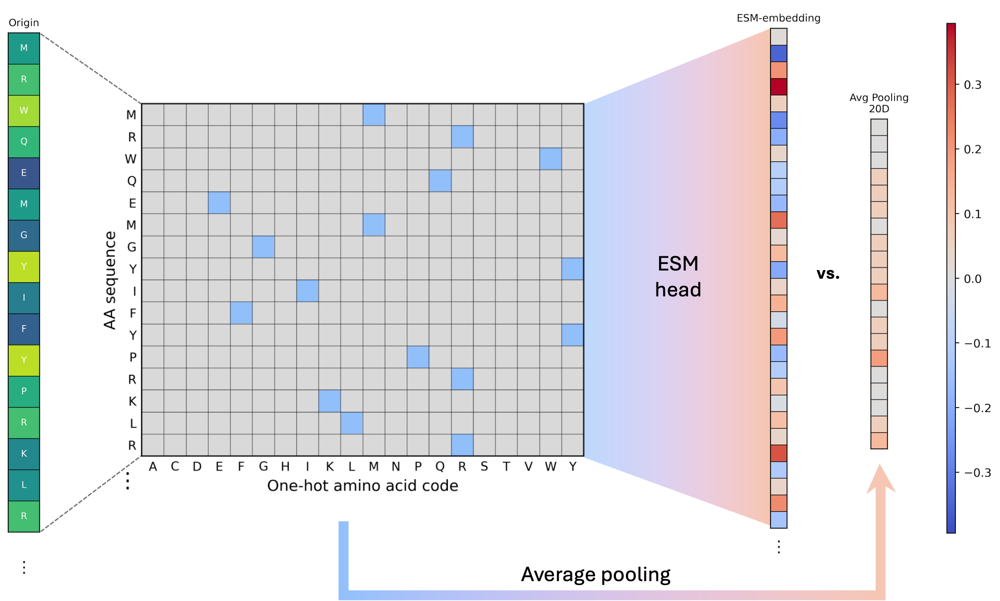

# Protein LLM DBP Prediction



This repository contains the code for a sequence-based DNA-binding protein (DBP) prediction workflow. The project integrates UniProt protein annotations, rule-based label construction, ESM-2 protein language model embeddings, amino-acid composition baselines, classical machine learning classifiers, ambiguity perturbation analysis, and misclassification interpretation.

## 中文摘要

DNA结合蛋白在转录调控、DNA复制、DNA损伤修复和基因组稳定性维持等过程中发挥关键作用，因此从大规模蛋白质序列中识别DNA结合蛋白有助于完善功能注释、解析调控网络并发现潜在疾病相关因子。本项目以经过审阅的人类UniProt蛋白质条目为基础，整合GO、Pfam、InterPro、关键词和自然语言功能描述等多源注释，构建了区分DNA结合蛋白、非DNA结合蛋白和弱置信度模糊类的标签逻辑。进一步地，项目比较了ESM-2蛋白质语言模型嵌入与简单氨基酸组成嵌入在多种分类器上的表现，并通过模糊类扰动和错误分类样本注释分析评估模型稳健性与生物学可解释性。结果表明，ESM-2嵌入显著优于平均池化对照，其中ESM-2结合支持向量机获得最佳整体表现，并在一定比例模糊样本扰动下保持较高稳定性。本项目展示了利用蛋白质语言模型和数据库注释构建可解释蛋白质功能预测流程的可行性，也为后续更细粒度的结合活性预测和跨功能类别泛化提供了基础。

## English Summary

DNA-binding proteins play essential roles in transcriptional regulation, DNA replication, DNA damage repair, and genome stability. Identifying DBPs from large-scale protein sequences can improve functional annotation, clarify regulatory networks, and reveal potential disease-associated regulatory factors. This project uses reviewed human UniProt protein entries and integrates GO, Pfam, InterPro, keyword annotations, and free-text functional descriptions to construct a rule-based labeling workflow that separates high-confidence DBPs, high-confidence non-DBPs, and ambiguous weak-confidence samples. The workflow then compares ESM-2 protein language model embeddings with a simple amino-acid composition baseline across multiple machine learning classifiers, followed by ambiguity perturbation tests and misclassification annotation analysis to evaluate robustness and interpretability. The results show that ESM-2 embeddings consistently outperform average-pooling composition features; the ESM-2 + SVM classifier gives the best overall performance and remains robust under moderate ambiguity perturbation. Overall, this work demonstrates a practical and interpretable sequence-based protein function prediction pipeline built from protein language models and curated database annotations.

## Data Sources and Databases

The starting dataset is a reviewed human protein table from UniProt. Each record contains protein identifiers, entry names, review status, protein names, gene names, organism information, sequence lengths, amino-acid sequences, GO annotations, Pfam and InterPro domain annotations, UniProt keywords, and functional comment text.

| Database | URL | Role in this project |
|---|---|---|
| UniProt | <https://www.uniprot.org/> | Source of reviewed human protein records, sequences, keywords, and functional descriptions. |
| Gene Ontology (GO) | <https://geneontology.org/> | Molecular function, biological process, and cellular component annotations used for DBP label construction. |
| AmiGO | <https://amigo.geneontology.org/amigo> | GO term browsing and verification. |
| InterPro | <https://www.ebi.ac.uk/interpro/> | Integrated protein family and domain annotations. |
| Pfam | <https://www.ebi.ac.uk/interpro/entry/pfam/> | Protein domain and family annotations used to identify DNA-binding domains. |

## Environment

Most steps were run locally on macOS. ESM-2 embedding extraction was run on the course HPC server using the shared virtual environment and Hugging Face model cache.

### Local Python Environment

```text
Python          3.13.11
pandas          3.0.1
numpy           2.4.3
matplotlib      3.10.8
seaborn         0.13.2
scikit-learn    1.8.0
scipy           1.17.1
Pillow          12.1.1
```

### Server Embedding Environment

```text
OS: Linux HPC
Python: 3.11
Virtual environment:
/gpfs1/share/26bioinfolab_grp7/dbp_prediction/.venv/bin/python

Model cache:
/gpfs1/share/lfl2026/huggingface_cache/

Main model:
facebook/esm2_t6_8M_UR50D
```

## Code Directory

| Script | Purpose | Main inputs | Main outputs |
|---|---|---|---|
| `Code/01_dataset_profile.py` | Clean the raw UniProt table and summarize dataset profiles. | `Data/human_protein_table.tsv` | Washed TSV and dataset profile figures. |
| `Code/02_label_dbp.py` | Assign three-class DBP labels using a rule-based annotation logic tree. | Washed protein annotation TSV | `protein_id`, `is_DBP`, and `sequence` label TSV plus label distribution plot. |
| `Code/03_extract_esm2_embedding.py` | Extract ESM-2 protein-level embeddings on the server. | Labeled TSV | Embedded TSV with JSON-encoded `embedded_sequence`. |
| `Code/04_add_average_pooling_embedding.py` | Add 20-dimensional amino-acid composition embeddings as a baseline. | Embedded/labeled TSV | TSV with `average_pooling_embedding`. |
| `Code/05_visualize_embeddings.py` | Visualize encoding schemes and embedding projections. | Embedded TSV | Encoding heatmaps, PCA/t-SNE panels, vector heatmaps. |
| `Code/06_train_baseline_models.py` | Train LR, RF, SVM, and MLP classifiers on ESM-2 and average-pooling features. | Embedded TSV | Cross-fold metrics, ROC/PR curves, confusion matrices, ambiguity perturbation plots. |
| `Code/07_misclassification_analysis.py` | Analyze false positives and false negatives for ESM-2 + SVM. | Embedded TSV and washed annotation TSV | Misclassified samples, annotation frequency tables, and misclassification figures. |

## Reproducibility Notes

The repository intentionally tracks code and lightweight documentation only. Raw data, intermediate TSV files, model embeddings, generated figures, local guidance documents, and report files are ignored by `.gitignore` because they are large or environment-specific. To reproduce the full workflow, place the raw UniProt table at `Data/human_protein_table.tsv`, run scripts in numeric order, and run `Code/03_extract_esm2_embedding.py` in the server environment described above.

All scripts expose command-line arguments:

```bash
python Code/01_dataset_profile.py --help
python Code/02_label_dbp.py --help
python Code/03_extract_esm2_embedding.py --help
python Code/04_add_average_pooling_embedding.py --help
python Code/05_visualize_embeddings.py --help
python Code/06_train_baseline_models.py --help
python Code/07_misclassification_analysis.py --help
```

## AI Usage Statement

This project was completed with vibe-coding assistance from OpenAI Codex (GPT-5). Codex helped draft and refactor Python scripts, diagnose runtime errors, organize visualizations, prepare README documentation, and review code structure. All biological definitions, annotation rules, model choices, interpretation of results, and final scientific conclusions were checked and approved by the author. Before release, the code was syntax-checked and command-line entry points were reviewed to ensure that the repository remains executable and reproducible within the stated environments.
